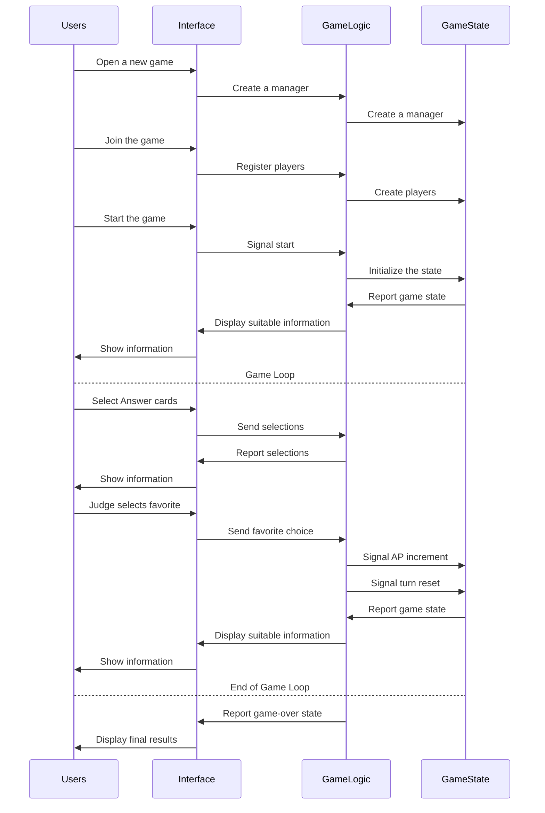

Install the extension [Markdown Preview Mermaid Support](https://marketplace.visualstudio.com/items?itemName=bierner.markdown-mermaid) to view the diagrams on VS Code.

An example data flow of a game:

